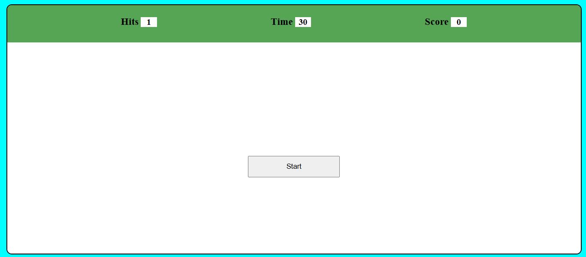
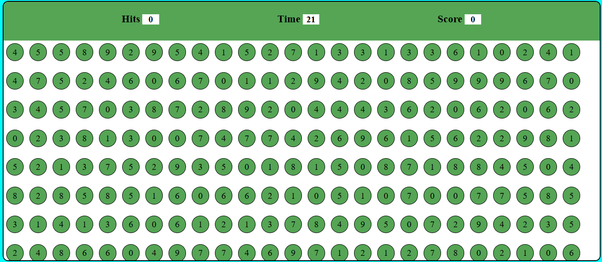
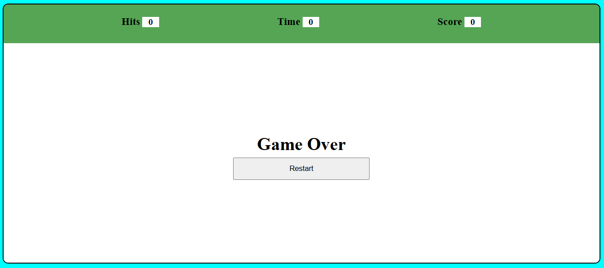

# 🎯 Bubble Game

An interactive bubble popping game made using HTML, CSS, and JavaScript. Hit the correct number before the timer runs out and score as much as you can!

---

## 🧠 Features

- Randomized bubbles with numbers
- Score tracking
- Timer countdown
- Game over & restart functionality

---

## 🖼️ Screenshots

### 🎮 Game Start

### ⏳ During Gameplay

### ❌ Game Over

---

## 🎥 Gameplay Video

Watch a short demo of the game in action:
👉 [Bubble Game Video](https://drive.google.com/file/d/1bcyiy1mg8_6pFJGthr7eWRyv6XqvtDTr/view?usp=drive_link)

---

## 🚀 How to Play

1. Click the "Start" button.
2. A number will appear under **Hits**.
3. Click the bubbles that match the number shown.
4. Get 10 points per correct hit!
5. When the timer reaches 0, the game ends.

---

## 📁 Tech Stack

- HTML
- CSS
- JavaScript

---

## 🧑‍💻 Author

- [Hari Prashath M G](https://github.com/Itshari2005)
